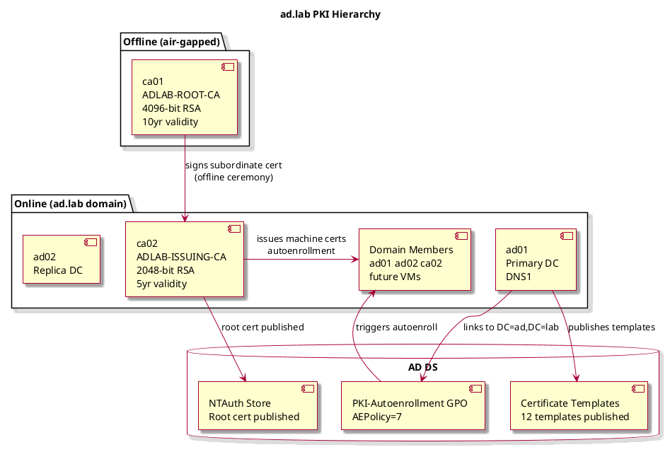
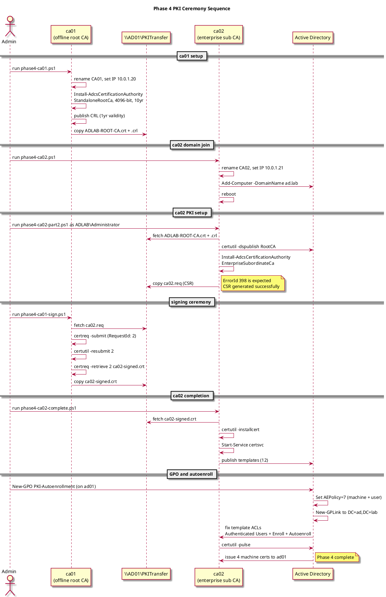
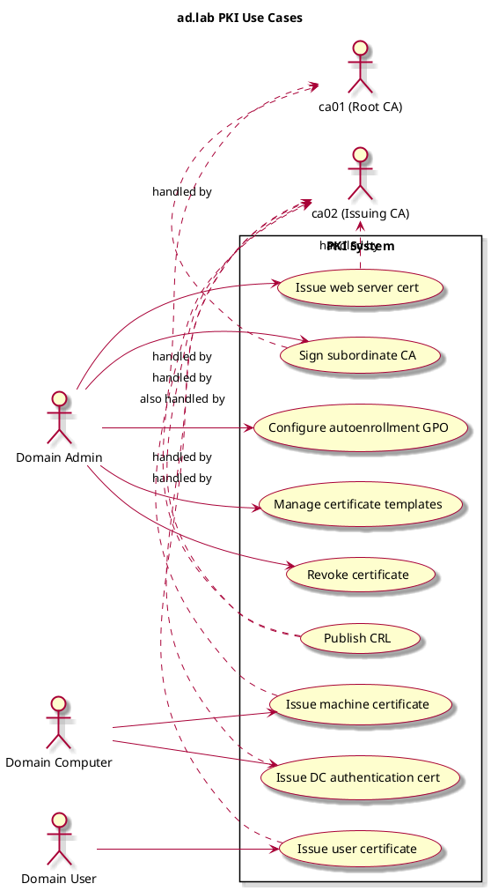
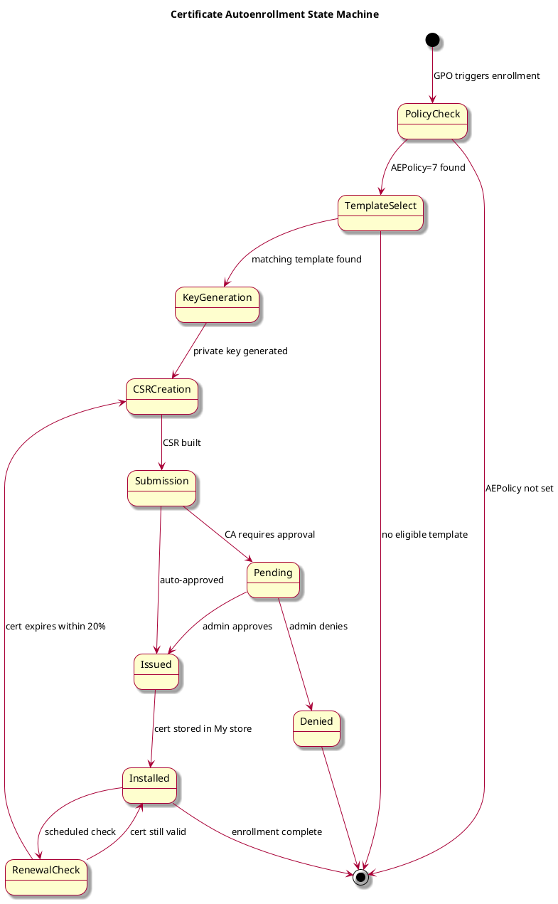

# ad.lab PKI Implementation — Phase 4 Reference Guide

## Two-Tier Certificate Authority Hierarchy

---

## 1. Overview

Phase 4 deploys a two-tier PKI (Public Key Infrastructure) for the ad.lab domain. The design follows Microsoft and NIST best practices: an offline standalone root CA (ca01) signs an online enterprise subordinate CA (ca02), which handles all certificate issuance to domain members via autoenrollment.

| Component       | Hostname    | IP Address | Role                               |
| --------------- | ----------- | ---------- | ---------------------------------- |
| Offline Root CA | ca01.ad.lab | 10.0.1.20  | Standalone Root CA — air-gapped    |
| Issuing CA      | ca02.ad.lab | 10.0.1.21  | Enterprise Subordinate CA — online |
| Primary DC      | ad01.ad.lab | 10.0.1.10  | AD DS, DNS, GPO management         |
| Replica DC      | ad02.ad.lab | 10.0.1.11  | AD DS replica, DNS secondary       |

---

## 2. CA Hierarchy

### 2.1 Design

The two-tier hierarchy isolates the root CA from the network. The root CA (ca01) is powered on only when needed to sign a new subordinate CA certificate, then shut down. This limits the blast radius if the issuing CA is ever compromised.

| CA               | Type            | Key Length   | Validity | Crypto Provider |
| ---------------- | --------------- | ------------ | -------- | --------------- |
| ADLAB-ROOT-CA    | Standalone Root | 4096-bit RSA | 10 years | MS Software KSP |
| ADLAB-ISSUING-CA | Enterprise Sub  | 2048-bit RSA | 5 years  | MS Software KSP |

### 2.2 Transfer share

A shared folder on ad01 (`C:\PKITransfer`) was used as the exchange point between the air-gapped ca01 and the online ca02. This simulates the USB drive transfer used in real production environments.

| File                   | Size        | Purpose                                  |
| ---------------------- | ----------- | ---------------------------------------- |
| ADLAB-ROOT-CA.crl      | 953 bytes   | Root CA Certificate Revocation List      |
| CA01_ADLAB-ROOT-CA.crt | 1,377 bytes | Root CA certificate                      |
| ca02.req               | 1,194 bytes | Subordinate CA certificate request (CSR) |
| ca02-signed.crt        | 1,884 bytes | Signed subordinate CA certificate        |

Create the share on ad01 before starting:

```powershell
New-Item -ItemType Directory -Path 'C:\PKITransfer' -Force
New-SmbShare -Name 'PKITransfer' -Path 'C:\PKITransfer' `
    -FullAccess 'ADLAB\Domain Admins' `
    -Description 'PKI certificate exchange'
```

---

## 3. Prerequisites

Before running any Phase 4 script:

- ad01 and ad02 must be promoted and replicating (Phase 3 complete)
- ca01 and ca02 must be running Windows Server 2022 Core on lab-lan
- ca01 and ca02 must have no prior IP or hostname configuration
- The PKITransfer share must exist on ad01
- ca02 must be added to the Cert Publishers group in AD:

```powershell
# Run on ad01 BEFORE starting ca02 setup
Add-ADGroupMember -Identity 'Cert Publishers' -Members 'CA02$'
Get-ADGroupMember -Identity 'Cert Publishers' | Select-Object Name, objectClass
```

---

## 4. Run Order

```
Step 1  ca01  phase4-ca01.ps1          Configure offline root CA
              (reboots once for rename, run again after reboot)
              Then copy C:\CAExchange\* to \\AD01\PKITransfer\

Step 2  ca02  phase4-ca02.ps1          Rename, set IP, join domain
              (reboots for rename, run again; reboots for domain join)

Step 3  ca02  phase4-ca02-part2.ps1    Install enterprise sub CA, generate CSR
              Run as ADLAB\Administrator
              Then ca02.req appears on \\AD01\PKITransfer\

Step 4  ca01  phase4-ca01-sign.ps1     Sign the CSR
              Then ca02-signed.crt appears on \\AD01\PKITransfer\

Step 5  ca02  phase4-ca02-complete.ps1 Install signed cert, publish templates
              Run as ADLAB\Administrator

Step 6  ad01  GPO + template ACL fix   Configure autoenrollment
              Run GPO and ACL commands on ad01 (not ca02)

Step 7  ad01  certutil -pulse          Verify autoenrollment works
```

---

## 5. Scripts

### 5.1 phase4-ca01.ps1 — Offline Root CA

Run on ca01. Will reboot once for rename then continue automatically.

```powershell
# phase4-ca01.ps1
# Run on ca01 - Windows Server 2022 Core
# Configures offline standalone root CA for ad.lab
# IP: 10.0.1.20/24

#Requires -RunAsAdministrator
Set-StrictMode -Version Latest
$ErrorActionPreference = 'Stop'

# Step 1 - Rename
Write-Host "[1/6] Renaming computer to CA01..." -ForegroundColor Cyan
if ($env:COMPUTERNAME -ne 'CA01') {
    Rename-Computer -NewName 'CA01' -Force
    Write-Host "     Renamed. Rebooting..." -ForegroundColor Yellow
    Restart-Computer -Force
    exit
}
Write-Host "     Already CA01." -ForegroundColor Green

# Step 2 - Static IP
Write-Host "[2/6] Setting static IP 10.0.1.20/24..." -ForegroundColor Cyan
$ifIndex = (Get-NetAdapter | Where-Object { $_.Status -eq 'Up' }).InterfaceIndex
Remove-NetIPAddress -InterfaceIndex $ifIndex -Confirm:$false -ErrorAction SilentlyContinue
Remove-NetRoute -InterfaceIndex $ifIndex -Confirm:$false -ErrorAction SilentlyContinue
New-NetIPAddress -InterfaceIndex $ifIndex -IPAddress '10.0.1.20' -PrefixLength 24 -DefaultGateway '10.0.1.1'
Set-DnsClientServerAddress -InterfaceIndex $ifIndex -ServerAddresses '10.0.1.10','10.0.1.11'
Write-Host "     IP set: 10.0.1.20/24" -ForegroundColor Green

# Step 3 - Install ADCS
Write-Host "[3/6] Installing AD Certificate Services..." -ForegroundColor Cyan
Install-WindowsFeature -Name ADCS-Cert-Authority -IncludeManagementTools
Write-Host "     Feature installed." -ForegroundColor Green

# Step 4 - Configure standalone root CA
Write-Host "[4/6] Configuring standalone root CA..." -ForegroundColor Cyan
Install-AdcsCertificationAuthority `
    -CAType                    StandaloneRootCa `
    -CACommonName              'ADLAB-ROOT-CA' `
    -CADistinguishedNameSuffix 'DC=ad,DC=lab' `
    -KeyLength                 4096 `
    -HashAlgorithmName         SHA256 `
    -ValidityPeriod            Years `
    -ValidityPeriodUnits       10 `
    -CryptoProviderName        'RSA#Microsoft Software Key Storage Provider' `
    -Force
Write-Host "     Root CA installed." -ForegroundColor Green

# Step 5 - CRL settings
Write-Host "[5/6] Configuring CRL settings..." -ForegroundColor Cyan
certutil -setreg CA\CRLPeriodUnits 1
certutil -setreg CA\CRLPeriod "Years"
certutil -setreg CA\CRLDeltaPeriodUnits 0
certutil -setreg CA\CRLDeltaPeriod "Days"
certutil -setreg CA\ValidityPeriodUnits 5
certutil -setreg CA\ValidityPeriod "Years"
Restart-Service certsvc
Start-Sleep -Seconds 5
certutil -crl
Write-Host "     CRL published." -ForegroundColor Green

# Step 6 - Export root cert and CRL
Write-Host "[6/6] Exporting root cert and CRL to C:\CAExchange..." -ForegroundColor Cyan
$exportPath = 'C:\CAExchange'
New-Item -ItemType Directory -Path $exportPath -Force | Out-Null
$crlDir = 'C:\Windows\System32\CertSrv\CertEnroll'
Copy-Item "$crlDir\*.crl" $exportPath -ErrorAction SilentlyContinue
Copy-Item "$crlDir\*.crt" $exportPath -ErrorAction SilentlyContinue

Write-Host ""
Write-Host "Root CA configured successfully." -ForegroundColor Green
Write-Host "Files in C:\CAExchange:" -ForegroundColor Yellow
Get-ChildItem $exportPath | Select-Object Name, Length
Write-Host ""
Write-Host "NEXT STEPS:" -ForegroundColor Cyan
Write-Host "  net use P: \\AD01\PKITransfer /user:ADLAB\Administrator" -ForegroundColor White
Write-Host "  copy C:\CAExchange\* P:\" -ForegroundColor White
Write-Host "  net use P: /delete" -ForegroundColor White
```

### 5.2 phase4-ca02.ps1 — Join domain

Run on ca02. Renames, sets IP, joins domain. Reboots twice — once for rename, once for domain join. Run the script again after each reboot.

```powershell
# phase4-ca02.ps1
# Run on ca02 - Windows Server 2022 Core
# Joins domain ad.lab
# IP: 10.0.1.21/24

#Requires -RunAsAdministrator
Set-StrictMode -Version Latest
$ErrorActionPreference = 'Stop'

# Step 1 - Rename
Write-Host "[1/4] Renaming computer to CA02..." -ForegroundColor Cyan
if ($env:COMPUTERNAME -ne 'CA02') {
    Rename-Computer -NewName 'CA02' -Force
    Write-Host "     Renamed. Rebooting..." -ForegroundColor Yellow
    Restart-Computer -Force
    exit
}
Write-Host "     Already CA02." -ForegroundColor Green

# Step 2 - Static IP
Write-Host "[2/4] Setting static IP 10.0.1.21/24..." -ForegroundColor Cyan
$ifIndex = (Get-NetAdapter | Where-Object { $_.Status -eq 'Up' }).InterfaceIndex
Remove-NetIPAddress -InterfaceIndex $ifIndex -Confirm:$false -ErrorAction SilentlyContinue
Remove-NetRoute -InterfaceIndex $ifIndex -Confirm:$false -ErrorAction SilentlyContinue
New-NetIPAddress -InterfaceIndex $ifIndex -IPAddress '10.0.1.21' -PrefixLength 24 -DefaultGateway '10.0.1.1'
Set-DnsClientServerAddress -InterfaceIndex $ifIndex -ServerAddresses '10.0.1.10','10.0.1.11'
Start-Sleep -Seconds 10
Write-Host "     IP set: 10.0.1.21/24" -ForegroundColor Green

# Step 3 - Verify connectivity
Write-Host "[3/4] Verifying connectivity to ad01..." -ForegroundColor Cyan
if (-not (Test-Connection -ComputerName '10.0.1.10' -Count 2 -Quiet -ErrorAction SilentlyContinue)) {
    Write-Host "ERROR: Cannot reach ad01. Check networking." -ForegroundColor Red
    exit 1
}
Write-Host "     ad01 reachable." -ForegroundColor Green

# Step 4 - Join domain
Write-Host "[4/4] Joining domain ad.lab..." -ForegroundColor Cyan
$domainCred = Get-Credential -Message "Enter ADLAB\Administrator credentials" `
    -UserName 'ADLAB\Administrator'
Add-Computer -DomainName 'ad.lab' -Credential $domainCred -Force
Write-Host "     Domain joined. Rebooting..." -ForegroundColor Yellow
Restart-Computer -Force
```

### 5.3 phase4-ca02-part2.ps1 — Enterprise subordinate CA

Run on ca02 AFTER domain-join reboot. **Must run as ADLAB\Administrator** (not local admin).

> **Critical:** If this fails with ERROR_DS_RANGE_CONSTRAINT verify you are running as `ADLAB\Administrator` not `ca02\administrator`. Check with `whoami`.

```powershell
# phase4-ca02-part2.ps1
# Run on ca02 AFTER domain-join reboot
# Run as ADLAB\Administrator

#Requires -RunAsAdministrator
Set-StrictMode -Version Latest
$ErrorActionPreference = 'Stop'

$transferShare = '\\AD01\PKITransfer'
$localExchange = 'C:\CAExchange'
New-Item -ItemType Directory -Path $localExchange -Force | Out-Null

# Step 5 - Import root CA cert and CRL
Write-Host "[5/7] Importing root CA certificate and CRL from share..." -ForegroundColor Cyan
$shareCred = Get-Credential -Message "Enter ADLAB\Administrator for share access" `
    -UserName 'ADLAB\Administrator'
New-PSDrive -Name PKI -PSProvider FileSystem -Root $transferShare -Credential $shareCred
Copy-Item 'PKI:\*' $localExchange -ErrorAction SilentlyContinue
Write-Host "     Files copied:" -ForegroundColor Green
Get-ChildItem $localExchange

$rootCert = Get-ChildItem $localExchange -Filter '*.crt' | Select-Object -First 1
certutil -addstore Root $rootCert.FullName
certutil -dspublish -f $rootCert.FullName RootCA
$crlFile = Get-ChildItem $localExchange -Filter '*.crl' | Select-Object -First 1
if ($crlFile) {
    certutil -addstore Root $crlFile.FullName
    certutil -dspublish -f $crlFile.FullName
}
Write-Host "     Root cert published to AD and local store." -ForegroundColor Green

# Step 6 - Install ADCS enterprise subordinate CA
Write-Host "[6/7] Installing ADCS enterprise subordinate CA..." -ForegroundColor Cyan
Install-WindowsFeature -Name ADCS-Cert-Authority -IncludeManagementTools

# Generates CSR — ErrorId 398 is expected and means success
Install-AdcsCertificationAuthority `
    -CAType                    EnterpriseSubordinateCa `
    -CACommonName              'ADLAB-ISSUING-CA' `
    -CADistinguishedNameSuffix 'DC=ad,DC=lab' `
    -KeyLength                 2048 `
    -HashAlgorithmName         SHA256 `
    -CryptoProviderName        'RSA#Microsoft Software Key Storage Provider' `
    -OutputCertRequestFile     "$localExchange\ca02.req" `
    -Force

Write-Host "     CSR generated: $localExchange\ca02.req" -ForegroundColor Green

# Step 7 - Copy CSR to share
Write-Host "[7/7] Copying CSR to transfer share..." -ForegroundColor Cyan
Copy-Item "$localExchange\ca02.req" 'PKI:\ca02.req'
Write-Host "     CSR copied to share." -ForegroundColor Green
Write-Host ""
Write-Host "NEXT: Run phase4-ca01-sign.ps1 on ca01" -ForegroundColor Cyan
```

### 5.4 phase4-ca01-sign.ps1 — Sign the CSR

Run on ca01 after ca02 has generated its CSR.

```powershell
# phase4-ca01-sign.ps1
# Run on ca01 AFTER ca02 has generated its CSR

#Requires -RunAsAdministrator
Set-StrictMode -Version Latest
$ErrorActionPreference = 'Stop'

$exchangePath = 'C:\CAExchange'
$csrFile      = "$exchangePath\ca02.req"
$certFile     = "$exchangePath\ca02-signed.crt"

Write-Host "=== ca01 signing subordinate CA request ===" -ForegroundColor Cyan

# Fetch CSR from share
Write-Host "[0/3] Fetching CSR from PKITransfer share..." -ForegroundColor Cyan
net use P: \\AD01\PKITransfer /user:ADLAB\Administrator
copy P:\ca02.req $csrFile
net use P: /delete
Write-Host "CSR found: $csrFile" -ForegroundColor Green

# Submit CSR to root CA
Write-Host "[1/3] Submitting CSR to root CA..." -ForegroundColor Cyan
$submitOut = certreq -submit -config "CA01\ADLAB-ROOT-CA" -attrib "CertificateTemplate:" $csrFile $certFile 2>&1
Write-Host $submitOut

$reqId = $null
$reqIdLine = $submitOut | Where-Object { $_ -match 'RequestId' } | Select-Object -First 1
if ($reqIdLine -match '(\d+)') { $reqId = $Matches[1] }

if (-not $reqId) {
    Write-Host "Enter the RequestID from the CA:" -ForegroundColor Yellow
    $reqId = Read-Host "RequestID"
}
Write-Host "Using RequestID: $reqId" -ForegroundColor Green

# Issue and retrieve
Write-Host "[2/3] Issuing certificate for RequestID $reqId..." -ForegroundColor Cyan
certutil -resubmit $reqId

Write-Host "[3/3] Retrieving signed certificate..." -ForegroundColor Cyan
certreq -retrieve -config "CA01\ADLAB-ROOT-CA" $reqId $certFile

if (Test-Path $certFile) {
    Write-Host "Signed certificate saved: $certFile" -ForegroundColor Green
    dir $certFile
    net use P: \\AD01\PKITransfer /user:ADLAB\Administrator
    copy $certFile P:\ca02-signed.crt
    net use P: /delete
    Write-Host "ca02-signed.crt is on the share." -ForegroundColor Green
    Write-Host "NEXT: Run phase4-ca02-complete.ps1 on ca02" -ForegroundColor Cyan
} else {
    Write-Host "Signed cert not generated. Check CA event log." -ForegroundColor Red
}
```

### 5.5 phase4-ca02-complete.ps1 — Complete CA installation

Run on ca02 as ADLAB\Administrator after ca01 has signed the CSR.

```powershell
# phase4-ca02-complete.ps1
# Run on ca02 as ADLAB\Administrator

#Requires -RunAsAdministrator
Set-StrictMode -Version Latest
$ErrorActionPreference = 'Stop'

$transferShare = '\\AD01\PKITransfer'
$localExchange = 'C:\CAExchange'
New-Item -ItemType Directory -Path $localExchange -Force | Out-Null

Write-Host "=== ca02 completing enterprise CA setup ===" -ForegroundColor Cyan

# Step 1 - Get signed certificate
Write-Host "[1/5] Fetching signed certificate from share..." -ForegroundColor Cyan
net use P: $transferShare /user:ADLAB\Administrator
copy P:\ca02-signed.crt "$localExchange\ca02-signed.crt"
copy P:\CA01_ADLAB-ROOT-CA.crt "$localExchange\CA01_ADLAB-ROOT-CA.crt"
copy P:\ADLAB-ROOT-CA.crl "$localExchange\ADLAB-ROOT-CA.crl"
net use P: /delete
dir $localExchange

# Step 2 - Install signed cert into CA
Write-Host "[2/5] Installing signed certificate into CA service..." -ForegroundColor Cyan
certutil -installcert "$localExchange\ca02-signed.crt"
Start-Service certsvc -ErrorAction SilentlyContinue
Start-Sleep -Seconds 10
Get-Service certsvc | Select-Object Name, Status

# Step 3 - Publish root CRL and cert to AD
Write-Host "[3/5] Publishing root CA cert and CRL to AD..." -ForegroundColor Cyan
certutil -addstore Root "$localExchange\CA01_ADLAB-ROOT-CA.crt"
certutil -addstore Root "$localExchange\ADLAB-ROOT-CA.crl"
certutil -dspublish -f "$localExchange\CA01_ADLAB-ROOT-CA.crt" RootCA
certutil -crl
Write-Host "     CRL published." -ForegroundColor Green

# Step 4 - Publish certificate templates
Write-Host "[4/5] Publishing certificate templates..." -ForegroundColor Cyan
$templates = @(
    'Computer','WebServer','User','DomainController',
    'DomainControllerAuthentication','DirectoryEmailReplication','Workstation'
)
foreach ($t in $templates) {
    try {
        Add-CATemplate -Name $t -Force -ErrorAction SilentlyContinue
        Write-Host "  Added: $t" -ForegroundColor Green
    } catch {
        Write-Host "  Skipped: $t" -ForegroundColor Yellow
    }
}

Write-Host "[5/5] GPO must be configured on ad01 (RSAT required)." -ForegroundColor Yellow
Write-Host "Run phase4-ad01-gpo.ps1 on ad01." -ForegroundColor Yellow
```

### 5.6 GPO and template ACL fix — run on ad01

Run all of these on ad01 after phase4-ca02-complete.ps1 finishes.

```powershell
# Run on ad01 as ADLAB\Administrator

# Part A - Create autoenrollment GPO
Import-Module GroupPolicy
$gpoName = 'PKI-Autoenrollment'
$domain  = 'ad.lab'

New-GPO -Name $gpoName -Domain $domain -ErrorAction SilentlyContinue

Set-GPRegistryValue -Name $gpoName -Domain $domain `
    -Key 'HKLM\SOFTWARE\Policies\Microsoft\Cryptography\AutoEnrollment' `
    -ValueName 'AEPolicy' -Type DWord -Value 7

Set-GPRegistryValue -Name $gpoName -Domain $domain `
    -Key 'HKCU\SOFTWARE\Policies\Microsoft\Cryptography\AutoEnrollment' `
    -ValueName 'AEPolicy' -Type DWord -Value 7

New-GPLink -Name $gpoName -Domain $domain `
    -Target 'DC=ad,DC=lab' -ErrorAction SilentlyContinue

Write-Host "Autoenrollment GPO linked to domain root." -ForegroundColor Green

# Part B - Fix template ACLs (Authenticated Users = Read + Enroll + Autoenroll)
Import-Module ActiveDirectory

$configNC     = (Get-ADRootDSE).configurationNamingContext
$templatePath = "CN=Certificate Templates,CN=Public Key Services,CN=Services,$configNC"
$authUsers    = [System.Security.Principal.SecurityIdentifier]'S-1-5-11'
$authNT       = $authUsers.Translate([System.Security.Principal.NTAccount])
$enrollGuid     = [guid]'0e10c968-78fb-11d2-90d4-00c04f79dc55'
$autoenrollGuid = [guid]'a05b8cc2-17bc-4802-a710-e7c15ab866a2'

# Note: Computer template CN is 'Machine' not 'Computer'
$templateCNs = @(
    'Machine','User','DomainController','WebServer','SubCA',
    'Administrator','EFS','EFSRecovery','KerberosAuthentication',
    'DirectoryEmailReplication','DomainControllerAuthentication','Workstation'
)

foreach ($cn in $templateCNs) {
    try {
        $dn  = "CN=$cn,$templatePath"
        $acl = Get-Acl "AD:$dn"

        $acl.AddAccessRule((New-Object System.DirectoryServices.ActiveDirectoryAccessRule(
            $authNT,
            [System.DirectoryServices.ActiveDirectoryRights]::GenericRead,
            [System.Security.AccessControl.AccessControlType]::Allow)))

        $acl.AddAccessRule((New-Object System.DirectoryServices.ActiveDirectoryAccessRule(
            $authNT,
            [System.DirectoryServices.ActiveDirectoryRights]::ExtendedRight,
            [System.Security.AccessControl.AccessControlType]::Allow,
            $enrollGuid,
            [System.DirectoryServices.ActiveDirectorySecurityInheritance]::None,
            [guid]::Empty)))

        $acl.AddAccessRule((New-Object System.DirectoryServices.ActiveDirectoryAccessRule(
            $authNT,
            [System.DirectoryServices.ActiveDirectoryRights]::ExtendedRight,
            [System.Security.AccessControl.AccessControlType]::Allow,
            $autoenrollGuid,
            [System.DirectoryServices.ActiveDirectorySecurityInheritance]::None,
            [guid]::Empty)))

        Set-Acl "AD:$dn" $acl
        Write-Host "Fixed: $cn" -ForegroundColor Green
    } catch {
        Write-Host "Failed: $cn - $($_.Exception.Message)" -ForegroundColor Red
    }
}

# Part C - Restart CA and verify
# Run on ca02
# Restart-Service certsvc

# Part D - Force GP update and test autoenrollment
gpupdate /force
certutil -pulse
Get-ChildItem Cert:\LocalMachine\My | Select-Object Subject, Issuer, NotAfter
```

---

## 6. Issues Encountered and Fixes Applied

### 6.1 certutil -ca.cert syntax error

`certutil -ca.cert` is display-only and takes no arguments. Passing a filename caused:

```
Expected no more than 1 args, received 2
```

**Fix:** Use `Copy-Item` from the `CertSrv\CertEnroll` folder directly. The fallback already exported both `.crt` and `.crl` correctly so no data was lost.

### 6.2 ERROR_DS_RANGE_CONSTRAINT (0x80072082) on ca02

Root causes identified in sequence:

1. ca02 computer account not in the **Cert Publishers** AD group
2. Session running as **ca02\Administrator** (local) not **ADLAB\Administrator** (domain)
3. Previous failed install left a **partial CA object** in AD
4. Wrong `-CAType` used — **EnterpriseRootCA** instead of **EnterpriseSubordinateCa**

Fixes applied:

```powershell
# 1. Add CA02 to Cert Publishers (on ad01)
Add-ADGroupMember -Identity 'Cert Publishers' -Members 'CA02$'

# 2. Remove partial CA install (on ca02)
Remove-WindowsFeature ADCS-Cert-Authority
Restart-Computer -Force

# 3. Reinstall as ADLAB\Administrator with correct type
Install-AdcsCertificationAuthority -CAType EnterpriseSubordinateCa ...
```

### 6.3 certutil -retrieve not found on Standalone CA

`certutil -retrieve` is not valid on a standalone CA.

| Wrong                           | Fix                                                         |
| ------------------------------- | ----------------------------------------------------------- |
| `certutil -retrieve 2 cert.crt` | `certreq -retrieve -config "CA01\ADLAB-ROOT-CA" 2 cert.crt` |

### 6.4 ErrorId 398 on ca02 subordinate CA install

This is **not an error**. ErrorId 398 means the subordinate CA installation is waiting for a signed certificate from the parent CA. The CSR was generated successfully. This is the expected state.

### 6.5 Template autoenroll showing Access is denied

`certutil -catemplates` showed `Access is denied` for all templates. Each certificate template object in AD needed **Authenticated Users** added with Read, Enroll, and Autoenroll extended rights.

Key issue: the **Computer template AD object CN is `Machine`** not `Computer`. All other templates use matching CN and display names.

> **Note:** `Access is denied` for EFS, WebServer, SubCA, and Administrator templates is expected even after the fix — those templates restrict autoenrollment to specific groups by design. The definitive test is `certutil -pulse` which issued 4 machine certs to ad01 confirming autoenrollment works.

### 6.6 PowerShell string terminator errors

Scripts containing long lines of repeated characters (e.g. `=` or `-` in Write-Host strings) caused `ParseException: TerminatorExpectedAtEndOfString` on Windows PowerShell when generated via Linux heredoc.

**Fix:** Remove all decorative separator lines from Write-Host statements.

### 6.7 Get-GPO not found on ca02

The GroupPolicy PowerShell module requires RSAT which is not installed on ca02. All GPO commands were moved to ad01 where the module is available.

---

## 7. Verification Results

| Test                         | Result              | Command                                               |
| ---------------------------- | ------------------- | ----------------------------------------------------- |
| CA service responding        | PASS                | `certutil -ping -config CA02.ad.lab\ADLAB-ISSUING-CA` |
| Templates published          | PASS — 12 templates | `certutil -catemplates`                               |
| Autoenrollment GPO linked    | PASS                | `gpresult /r \| Select-String PKI`                    |
| Machine certs issued to ad01 | PASS — 4 certs      | `certutil -pulse`                                     |
| Root cert in AD NTAuth store | PASS                | `certutil -viewstore -enterprise NTAuth`              |
| AD replication healthy       | PASS                | `repadmin /replsummary`                               |

---

## 8. Quick Reference

### Key commands

| Command                                               | Run on            | Purpose                        |
| ----------------------------------------------------- | ----------------- | ------------------------------ |
| `certutil -ping -config CA02.ad.lab\ADLAB-ISSUING-CA` | any domain member | Verify CA is alive             |
| `certutil -pulse`                                     | any domain member | Force autoenrollment check     |
| `certutil -catemplates`                               | ca02              | List templates and access      |
| `certutil -crl`                                       | ca01 or ca02      | Publish new CRL                |
| `gpupdate /force`                                     | any domain member | Apply GPO including autoenroll |
| `Get-ChildItem Cert:\LocalMachine\My`                 | any domain member | List machine certs             |
| `repadmin /replsummary`                               | ad01 or ad02      | AD replication health          |
| `Restart-Service certsvc`                             | ca02              | Restart CA service             |

### Important file locations

| Path                                      | VM            | Contents                      |
| ----------------------------------------- | ------------- | ----------------------------- |
| `C:\CAExchange\`                          | ca01 and ca02 | Cert/CRL/CSR exchange files   |
| `C:\PKITransfer` (share)                  | ad01          | Network transfer point        |
| `C:\Windows\System32\CertSrv\CertEnroll\` | ca01 and ca02 | Auto-published certs and CRLs |
| `Cert:\LocalMachine\My`                   | any VM        | Machine certificates          |
| `Cert:\LocalMachine\Root`                 | any VM        | Trusted root CA certs         |
| `Cert:\LocalMachine\CA`                   | any VM        | Intermediate CA certs         |

### Template CN name mapping

| Display Name                | AD CN                     | Notes                        |
| --------------------------- | ------------------------- | ---------------------------- |
| Computer                    | **Machine**               | CN differs from display name |
| User                        | User                      |                              |
| Domain Controller           | DomainController          |                              |
| Web Server                  | WebServer                 |                              |
| Kerberos Authentication     | KerberosAuthentication    |                              |
| Directory Email Replication | DirectoryEmailReplication |                              |
| Workstation                 | Workstation               |                              |
| Subordinate CA              | SubCA                     | Manual enrollment only       |

---

## 9. PlantUML Diagrams

Render at [plantuml.com](https://plantuml.com) or locally with `plantuml filename.puml`.

### 9.1 PKI Hierarchy Component Diagram



### 9.2 PKI Ceremony Sequence Diagram



### 9.3 Use Case Diagram



### 9.4 Certificate Autoenrollment State Machine



### 9.5 PKI Network Deployment (nwdiag)

```plantuml
@startnwdiag
title ad.lab PKI Network Layout

nwdiag {

  group {
    color = "#E1F5EE"
    description = "PKI tier"
    ca01
    ca02
  }

  group {
    color = "#EDE7FF"
    description = "Identity tier"
    ad01
    ad02
  }

  network lan {
    address = "10.0.1.0/24"
    color   = "#E8EAF6"
    width   = full

    ca01 [address = "10.0.1.20",
          description = "ca01\nADLAB-ROOT-CA\nOffline root CA\nWin Server 2022"]
    ca02 [address = "10.0.1.21",
          description = "ca02\nADLAB-ISSUING-CA\nEnterprise sub CA\nWin Server 2022"]
    ad01 [address = "10.0.1.10",
          description = "ad01\nPrimary DC DNS1\nWin Server 2019"]
    ad02 [address = "10.0.1.11",
          description = "ad02\nReplica DC\nWin Server 2022"]
  }
}

legend
  ca01 NIC present but disable after Phase 4 is complete
  All cert issuance goes through ca02 only
  PKITransfer share on ad01 used for offline cert exchange
end legend
@endnwdiag
```

---

_ad.lab Phase 4 Reference Guide — April 2026_
